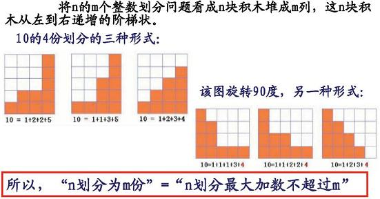

# 提示
---
[toc]

## 2-1有重复元素的排列问题
课本上有“递归”实现无重复元素全排列的源程序。
稍加修改即可满足此题要求。

在递归产生全排列的那段程序开始之前，
加一个判断：判断第i个元素是否在list[k,i-1]中出现过。
```
PermExcludeSame(char list[], int k, int m)
{
  ......
  for (int i=k; i<=m; i++)
  {
    if (Findsame(list,k,i))//判断第i个元素是否在list[k,i－1]中出现过
       continue;
    Swap (list[k], list[i]);
    PermExcludeSame(list, k+1, m);
    Swap (list[k], list[i]);
  }
}
```

## 2-4整数因子分解
此题因子讲顺序的.第一个因子可能是2~n之间的数.
比如对12而言,第一个因子可能是2,3,4,6,12.

将第一个因子为2的分解个数,加上第一个因子为3的分解个数,...,直至加到第一个因子为12的分解个数.

而第一个因子为2的分解个数又是多少呢?是6(因为12/2=6)的分解个数,递归求解!

可用“递归”和“备忘录方法”两种方法分别求解，并测试一下效率。

递归实现整数因子分解的计数。假设对正整数n的因子分解计数为solve(n)。
1）当n=1时，计数加1。
2）当n>1时，对n的每个因子i，计算solve(n/i)。

或者这样实现也可以：
```
int solve2(int n)
{
    int num=0;

    if(n==1) return 1;

    for(int i=2; i<=n; i++)
        if(n%i == 0) num+=solve2(n/i);

    return num;
}

```
## 2-5两个有序数序列中找第k小
假设：X序列为X[xBeg...xEnd]，而Y序列为Y[yBeg...yEnd]。

将序列X和Y都均分2段，即取X序列中间位置为 xMid (xMid = xBeg+(xEnd-xBeg)/2)，也同理取序列Y中间位置为yMid。
比较X[xMid]和Y[yMid]的大小，此时记录X左段和Y左段元素个数合计为halfLen，即halfLen = xMid-xBeg+yMid-yBeg+2。

1. 当X[xMid] < Y[yMid]时，在合并的数组中，原X[xBeg...xMid]所有元素一定在Y[yMid]的左侧，
   （1） 若k < halfLen，则此时第k大的元素一定不会大于Y[yMid]这个元素，
         故以后没有必要搜索 Y[yMid...yEnd]这些元素，可弃Y后半段数据。
         此时只需递归的对X序列+Y序列的前半段，去搜索第k小的数。

   （2） 若k >= halfLen，则此时第k大的元素一定不会小于X[xMid]这个元素，
         故以后没有必要搜索 X[xBeg...xMid]这些元素，可弃X前半段数据。
         此时只需递归的对X序列的后半段+Y序列，去搜索第 k-(xMid-xBeg+1）小的数。

2. 当X[xMid] >= Y[yMid]时，在合并的数组中，原Y[yBeg...yMid]的所有元素一定在X[xMid]的左侧，
   （1） 若k < halfLen，则此时第k大的元素一定不会大于X[xMid]这个元素，
         故以后没有必要搜索 X[xMid...xEnd]这些元素，可弃X后半段数据。
         此时只需递归的对X序列的前半段+Y序列，去搜索第k小的数。

   （2） 若k >= halfLen，则此时第k大的元素一定不会小于Y[yMid]这个元素，
         故以后没有必要搜索 Y[yBeg...yMid]这些元素，可弃Y前半段数据。
         此时只需递归的对X序列+Y序列的后半段，去搜索第 k-(yMid-yBeg+1）小的数。

递归的边界，如何来写？
1) if (xBeg > xEnd) return Y[yBeg + k - 1];  //X序列为空时，直接返回Y序列的第k小元素。
2) if (yBeg > yEnd) return X[xBeg + k - 1];  //Y序列为空时，直接返回X序列的第k小元素。


效率分析：

T(m,n)表示对长度为m的有序的X序列和长度为n的有序的Y序列，搜索第k小元素的复杂度。
T(m,n)=1   m=0或n=0
T(m,n) <= max{T(m/2,n), T(m,n/2)} + O(1)

则T(m,n) = O(max{logm, logn})


## 2-8整数划分的扩展问题
这四个问题，不但要分析递归关系，还要正确写出递归的边界，有时边界值错一个，结果都不一定对，因此要小心。

1, 问题（1）即为书上例2-5。


2, 问题（2）也可以这样来想：
设d[i][j]表示i划分为j份，视为i个球放入j个盒子的方法数。d[n][m]为题目问题（2）所求，d[i][j]有如下递推关系：
（1）j个盒子有空的，d[i][j]=d[i][j-1]，把某一空盒子拿出来放一边
（2）j个盒子都不空，d[i][j]=d[i-j][j]，每个盒子扣掉1个球
因此，d[i][j] = d[i][j-1] + d[i-j][j], j>1；
特别的有： d[k][0]=0, k>=1； d[k][1]=1, k>=1


3, 问题（1）和问题（2）是结果是相同的。
可以证明，任何一个问题（1）的解都可以转化为另一个问题（2）的解，一一对应，因此记数相同。

这个证明思路可以参考如下：
对正整数n进行划分，不超过m个的划分，视为n块立方体积木堆成m列，垂直的来看n=n1+n2+...+nm。
对每一个堆法，将视角旋转90度，即水平方向上看，其实都对应一个最大加数不超过m的划分。
因此，对正整数n进行划分，不超过m个的划分，换种视角，都对应于一个最大加数不超过m的划分。反之亦然。
所以，这种对应是一一对应。因此，不超过m个加数的划分数 = 最大加数不超过m的划分数。

如下图所示：



4, 设： Odd(I,J)表示I划分为J个正奇数的划分数; Even(I,J)表示I划分为J个正偶数的划分数.
有如下递推关系：
（1）Even(I,J) = Odd(I-J,J), 每个偶加数减掉1变为奇加数
（2）Odd(I,J) = Odd(I-1,J-1) + Even(I-J,J)， 加数含1的方式数 + 加数不含1的方式数
（3）特别的：  J>I || J<0, Odd(I,J)=0;
             Odd(1,1)=1, Odd(2,1)=0, Odd(2,2)=1
             J>I || J<0, Even(I,J)=0;
             Even(1,1)=0, Even(2,1)=1, Even(2,2)=0


5, 思想： 转化为子集和问题： 集合{1,2,…,n}，挑选若干正整数，使之和为n，这也是一个背包装物品问题。
设F(I,J)： 表示挑选集合前I个，使之和为J的方式数。
递推关系： F(I,J) = F(I-1,J) + F(I-1,J-I)， 第I个不挑的方式数 + 挑第I个的方式数
递推边界： F(1,1)=1, F(1,k)=0(k>1), F(I,k)=0(k<0), F(I,0)=1(I>0)
（这里一个都没挑，值为0，也是一种方式，所以为1）


6, 其实这第(4)个问题的解也和第(3)问题的解是相同的


## 3-2最长上升子序列
 一，对输入字符串的处理

注意：这道题和其他题的输入输出不同,这题是接收多组数据而非单组,以0来判别结束。
大家在接受数据的时候，不要用(c=getchar())!='\n'诸如此类一个字符一个字符接受，
然后判断是否是回车符号来结束一行的输入，这样的方式在你本机运行不会有问题，
但OJ系统中会有错误，无法输出结果，因为测试平台行末并非'\n'字符。
这里接受数据用scanf的%d或%s，或cin等，会自动判别结束字符的，你就不要在你程序
里专门去判别或吸收回车字符。

对于最后一组数据输入为0表示结束，只要判断接受的第一个字符是否为0且字
符串长度为1就结束，无须去处理回车字符。

输入的序列可以用整型数组或字符串数组保存。


二，算法的动态规划思想

考虑采用动态规划算法，针对每个元素，以该元素结尾的最长有序子序列作为子问题，
计算出每个子问题的最大长度用“表”记录下来。先写出递推关系式再编程实现。

设f(i)表示：从左向右扫描过来直到以a[i]元素结尾的序列，可获得的最长上升
子序列的长度，且最长上升子序列包含a[i]元素（1<=i<=n）。

（这里大家思考一下，为何要这样假设子问题和子问题最优解f(i)？
有同学问：为何最长上升子序列要包含a[i]元素（1<=i<=n）？
因为你所设的子问题要和更下一级子问题关联起来。如果长度为i序列的最长上升
子序列中没有规定包含a[i]元素，那如何和其前缀的最长上升子序列问题关联起来
呢，那样显然是比较麻烦的。）

f(i)是从f(1),f(2), ……到f(i-1)中找最大的一个值，再加1，或者就是1。
这主要得看a[i]这个元素能否加入到之前已经获得的最长上升子序列当中去，
如果能加入，是之前已获得的最长上升子序列长度加1；
如果不能加入，就开始一个新的上升子序列，长度为1。
最后，所要求的整个序列的最长上升子序列长度为 max{ f(i): 1<=i<=n }

f(i)的递推公式如下：
（1）f(i) = 1              当i=1;
（2）f(i) = max{f(j)+1}    当i>1, 对某个前面的j(1<=j<i), 有a[j]<a[i]];
（3）f(i) = 1              当i>1, 对任意j(1<=j<i), 都有a[j]>=a[i]

例子，对于序列：4  2  6  3  1  5  2
   i = 1  2  3  4  5  6  7
a[i] = 4  2  6  3  1  5  2
f(i) = 1  1  2  2  1  3  2

这里max{f(i)}=3为原问题所求的最长上升子序列的长度。

效率分析：
f(i)的计算不超过O(n)，因此，整个算法为O(n^2)。


## 3-3最长公共子字符串
一，对输入字符串的处理
大家在接受数据的时候，不要用(c=getchar())!='\n'诸如此类一个字符一个字符接受，然后判断是否是回车
符号来结束一行的输入，这样的方式在你本机运行不会有问题，但OJ系统中会有错误，无法输出结果，因为
测试平台行末并非'\n'字符。这里接受数据用scanf的%s，或cin等，会自动判别结束字符的，你就不要在你
程序里专门去判别或吸收回车字符。

二，递推公式
此题和书上3.3节"最长公共子序列"描述是不同的.
子序列不连续,子字符串认为是连续的.
此题更加简单!

假设求字符串str1,str2的最长公共子串的长度.
定义f(m,n)：   分别以str1[m],str2[n]结尾的最长连续公共子串的长度，
               其中字符串末尾的str1[m]和str2[n]包含在最长公共子串中，即为最长公共子串的最末元素。

（这里大家思考一下，为何要这样假设子问题和子问题最优解f(m,n)？
因为子串是连续的，更大规模问题和下一级更小规模的子问题要能联系起来，而且这种联系还要越简单越好，
只有规定原先两个串的最末元素包含在最长公共子串中，这样就能联系上两个串的前缀部分（都去掉末个元
素）的最长公共子串问题。）

而对于f(m+1,n+1) 有：
1) f(m+1,n+1) = 0,             if str1[m+1] != str2[n+1]
2) f(m+1,n+1) = f(m,n) + 1,    if str1[m+1] == str2[n+1]
3) 另外边界情况，f(0,j)=0(j>=0), f(j,0)=0(j>=0)

而此题所求的最长公共字符串的长度即为f(m,n)整个二维数组中的最大值，注意不是填充的最后一个元素。
至于如何优先输出在源串X靠左的公共子串，大家自行思考。

## 3-6不能移动的石子合并

 （1）第一个石子合并模型

和书上3.1节的矩阵连乘问题类似。假设m[i,j]为合并石子ai…aj，1<=i<=j<=n。所得到的最小
得分，若没有“合并”这个动作，则为0。
原问题所求的合并最小值即为m[1,n]。

递推公式如下，其中min表示求最小，sum表示求和。
    m[i,j] = 0,   if i=j
    m[i,j] = min{ m[i,k]+m[k+1,j] | for all k, i<=k<j } + sum{ a(t) | for all t, i<=t<=j },
                  if i<j

至于求最大值完全同理，自行推导递归公式。


（2）第二个石子合并的环行模型

方法一、环型模型完全可以转化为行型模型来求解。
环形模型可视为等价的行形模型： A1 ... An A1 ... An-1，共2n-1堆，并在此行形模型中合并石头不超过
链长n。
环行模型问题所求，不是等价模型所填充的右上方元素m[1,2n-1]，而是m[1,n], m[2,n+1], …, m[n,2n-1]
这n个斜行元素中的最小值，
即： min{ m[i, n+i-1] | for all i, 1<=i<=n }


方法二、定义链，但环型定义链如果和前面行型一样，用链的起始和结束下标的话，不好定义，我们得换一
种定义方式，加入链长这个参数而去掉结束下标这个参数。

定义环行的链p(i,r)，表示石头堆链Ai, A[(i+1)%n], ..., A[(i+r-1)%n]。  那链p(i,r)能够合并的最小分
值记为m(i,r)。这里，1<=i<=n, 1<=r<=n。

Ai  ...  A[(i+s-1)%n]    A[(i+s)%n]  ...  A[(i+r-1)%n]
---------------------    -----------------------------
      s个（链长s）                r-s个（链长r-s）

最后一次合并在A[(i+s-1)%n]和A[(i+s)%n]之间，分为两个子链，左一个子链是p(i,s)，右一个子链是p((i+s)%n, r-s)。
链p(i,r)的最优值由两个子链的最优值得到。

   m(i,r) = 0     r=1;
   m(i,r) = min{ m(i,s)+m((i+s)%n, r-s) | for all s, 1<=s<r} + sum{a(t) | for all t, i<=t<=(i+r-1)%n }
               1<r<=n

由链长增加的方向来填充m(i,r)数组，原问题所求为： max{m(i,n) | 1<=i<=n}

例如： n=5，  A1 A2 A3 A4 A5 构成环行。
计算：
r=1, m[i,1] （1<=i<=n）， 即：m[1,1], m[2,1], m[3,1], m[4,1], m[5,1]。 
对应的矩阵链为：A1, A2, A3, A4, A5；
r=2, m[i,2] （1<=i<=n）， 即：m[1,2], m[2,2], m[3,2], m[4,2], m[5,2]。 
对应的矩阵链为：A1A2, A2A3, A3A4, A4A5, A5A1；
r=3, m[i,3] （1<=i<=n）， 即：m[1,3], m[2,3], m[3,3], m[4,3], m[5,3]。 
对应的矩阵链为：A1A2A3, A2A3A4, A3A4A5, A4A5A1, A5A1A2；
......
r=n, m[i,n] （1<=i<=n）， 即：m[1,n], m[2,n], m[3,n], m[4,n], m[5,n]。 
对应的矩阵链为：A1A2...An, A2A3...A1, A3A4...A2, A4A5...A3, A5A1...A2；

对m二维数组一列一列填充，原问题所求环行的最小得分为最后填充的一列m元素：
m[1,n], m[2,n], m[3,n], m[4,n], m[5,n]的最大值，即 max{m(i,n) | 1<=i<=n}。

## 4-1区间相交问题
等同于书本的活动安排问题。
## 4-2可以移动的石子合并
此题贪心算法求解.
给这题标记标签"dp"方法是同学所为,并非老师标注.动规不是不可以,但有更好更快的贪心解法的.

如7堆石头，每次可选择最少2堆最多3堆合并，可以如下这样合并：
第1次合并：45+22=67
第2次合并：67+16=83
第3次合并：83+13=96
第4次合并：96+12=108
第5次合并：108+9=117
第6次合并：117+5=122
合并的总分值：67+83+96+108+117+122=593，593已是最大分值。

也可以这样合并：
第1次合并：5+9+12=26
第2次合并：13+16+22=51
第3次合并：45+51+26=122
合并的总分值：26+51+122=199，199已是最小分值。

因此此题贪心的方法如下：

（1）保证每次选两堆最多的，合并直至只剩一堆为止，能获得最大得分；
这个和huffman树构造是相同的，不再详述！

（2）保证每次选k堆最少的，合并直至只剩一堆为止，能获得最小得分。
这个是多元huffman树的构造。要注意的是：在合并之前，若n%(k-1)!=1，说明合并到最后一轮时，
剩下不是k堆（而是比k堆少），这样算的并不是最小得分，而必须在合并之前添加若干个为0的虚拟
堆，目的为凑成的堆数保证每次都能有k堆合并（包括最后一次）最后合并为1堆。

因此，在合并前作如下处理：

//假设石头每堆个数放于stone[1]~stone[n],且stone[n]之后最多k-1个数组单元为可写;
while (n % (k - 1) != 1)
{
        n++;
        stone[n]=0;
}
## 5-1骑士问题
这也是一个搜索的题目，非常类似于书上的“布线问题”，解法几乎同，可参考书上此范例。

用一个二维数组board[12][12]来记录棋盘的状况。为何大小是12*12呢？
棋盘大小8*8，为了减少对周围边界的判断，在上下左右四边各加上2行2列做“围墙”（障碍），
因此board棋盘的大小12*12。

有如下几个问题或步骤需要解决：

1， 障碍格子：将输入的障碍格子填写到board当中对应格上，设置为-1；
2， 起始格子和结束格子：将起始点start和结束点end，这两个点记录下来，在board中这两个
格子设置为0；
3， 围墙：在8*8的棋盘外面，上下左右各加2行2列做围墙，围墙和障碍一样，设置为-1；
4， 除障碍、围墙、起始、结束格子这些格子特殊对待之外，其余格子全部初始化为0；
5， 队列初始为空。队列是用来在骑士做 “日字型”对角跳的时候，候选位置放入队列中的
一个辅助的数据结构，以便于“广度优先搜索”。
6， 从起点开始，将这个位置所能跳的周围8个位置都检查一下：只要未标记，就标记为前一个
位置值加1，并将该位置入队列；
    如果不能标记（比如障碍或围墙等），就跳过，继续检查下一个位置，一共八个骑士所能
跳的位置。
7， 取出队列首个位置结点，又继续检查这个结点周围的8个位置，类同上一步，直到找到对终
点标记位置。
8， 最后，输出终点所标记的数值（正数），就是骑士所需的最少移动步数，若为0表示终点无
法标记到，输出：“not reachable”这样的信息。

1--5为初始化步骤，在标记之前就应该做好棋盘和相关辅助数据结构的初始化；
6--8为标记过程。

## 5-2子集和问题
解空间树是“子集树”。
回溯法搜索，由于是深度优先的找，找到就退出。
参考书上的“装载问题”和书上的“0-1背包问题”来写，因为都是搜索子集树。
但此题无法有很好的剪枝优化，要求只输出“在子集树中按深度优先方向遇到的第一个解”，因此找到一个符合
条件的叶子就退出。

有个问题就是，找到第一个解就退出，怎么退出呢？
若你是用循环的迭代回溯实现，由于循环是很好退出的，要退出搜索，就break出来即可，很简单。但若是递归实
现的回溯过程，因是递归函数的逐层调用，现在要退出整个递归过程，如何一层一层退出被递归调用的函数？

解决办法就是加一个全局的标志found，found初始化为false。
当found标志为false时，就可递归深入下去，但当标志为true时，直接退出本次函数的过程。found标志需要
在找到第一个叶子时更新为true。

## 5-3工作分配问题
n个人，任何一种站队排列，都构成搜索的情况。因此，搜索的解空间树是“排列树”。

搜索的算法可以参考书本上“批处理作业调度问题”或“旅行售货员问题”的解法，因为都是排列树的搜索。
套用排列树的回溯算法搜索框架来实现。

## 5-4多机最佳调度
第（1）个贪心算法按书上思想去实现。
第（2）个就是在m叉树上深度优先搜寻最优解的过程。
```
//t数组为初始的任务处理时间；
//len2是个数组：m个元素对应m台机的空闲时间，即第二种回溯算法在搜索过程中已探察过任务且针对某台机的完成时间和；
//x数组用来保存探察过的任务编号。
void backtrack (int dep)
{
    if (dep == n) //叶子，或者if (dep>n)，看首次调用backtrack参数是0还是1
    {
        ……       //这个省略号，要你自己来扩展了，要找到最好的叶子（即最早完成时间的一组最优调度）
        return;
    }

    for(int i = 0; i < m; i++)
    {
        len2[i] += t[dep];   //len2数组和t数组如上说明
        x[dep] = i+1;

        if(len2[i] < best)
        {
        	    backtrack(dep+1);
        }

        len2[i] -= t[dep];
    }
}
```

